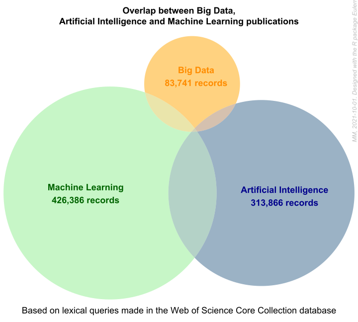

# Content

R Scripts and data to reproduce the figures of the _AI and Society_ research article: "The future of urban models in the Big Data and AI era: a bibliometric analysis (2000-2019)."

#### Citation
Maisonobe, Marion. 2021. Scripts and data for _AI and Society_ research article: "The future of urban models in the Big Data and AI era: a bibliometric analysis (2000-2019). DOI: [10.5281/zenodo.4537210](https://doi.org/10.5281/zenodo.4537210)"

#### Overlap between Big Data, AI and Machine Learning corpus of publications 

Using the [`Eulerr`](https://cran.r-project.org/package=eulerr) package.

#### Contact
For any question, feel free to contact [me](https://geographie-cites.cnrs.fr/membres/marion-maisonobe/) 

#### Licence
This repository is released under the <a href="LICENSE">**GNU AFFERO GENERAL PUBLIC LICENSE v3**</a>
